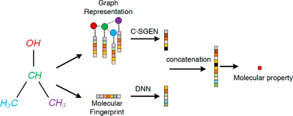

<h1 align="center">
C-SGEN
</h1>

<h3 align="center">
Molecule Property Prediction Based on Spatial Graph Embedding
</h3> 

---

# Abstract
Accurate prediction of molecular properties is important for new compound design, which is a crucial step in drug discovery. In this paper, molecular graph data is utilized for property prediction based on graph convolution neural networks. In addition, a convolution spatial graph embedding layer (C-SGEL) is introduced to retain the spatial connection information on molecules. And, multiple C-SGELs are stacked to construct a convolution spatial graph embedding network (C-SGEN) for end-to-end representation learning. In order to enhance the robustness of the network, molecular fingerprints are also combined with C-SGEN to build a composite model for predicting molecular properties. Our comparative experiments have shown that our method is accurate and achieves the best results on some open benchmark datasets. 

# User Notification
The model is used in the company's [Protac database project](https://molblock.cn/index.html#/target) and is currently being integrated into the company's internal software. 
If need cooperation, please contact:
xiaofeng@mindrank.ai

